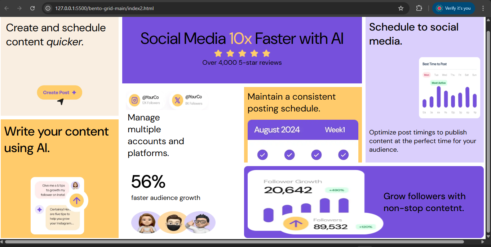
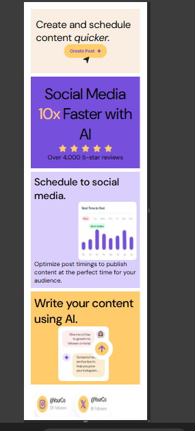

# Frontend Mentor - Bento grid solution
 

## Table of contents

- [Overview](#overview)
  - [The challenge](#the-challenge)
  - [Screenshot](#screenshot)
  - [Links](#links)
- [My process](#my-process)
  - [Built with](#built-with)
  - [What I learned](#what-i-learned)
  - [Continued development](#continued-development)
  - [Useful resources](#useful-resources)
- [Author](#author)
- [Acknowledgments](#acknowledgments)

**Note: Delete this note and update the table of contents based on what sections you keep.**

## Overview

### Screenshot

### Links

- Solution URL: [Add solution URL here](https://your-solution-url.com)
- Live Site URL: [Add live site URL here](https://your-live-site-url.com)

## My process

### Built with

- Semantic HTML5 markup
- CSS custom properties
- Flexbox
- CSS Grid

**Note: I forgot to follow the mobile-first approach and created the project based on the desktop design first.**

### What I learned

In this project, I strengthened my command over CSS Grid, understood Flexbox, and clarified my concepts of media queries. I learned how to use margin and padding effectively to design my project beautifully.

## Author

- Website - [Vandana](https://www.your-site.com)
- Frontend Mentor - [@Vandana6261](https://www.frontendmentor.io/profile/yourusername)
- Twitter - [@Vandana_345](https://www.twitter.com/yourusername)

